# MSP Billing System Design

## System Purpose

The flexible billing system is designed to support various billing models commonly used by Managed Service Providers (MSPs). It allows for complex billing scenarios, including fixed-price plans, time-based billing, usage-based billing, hybrid models, bucket of hours/retainer models, discounts and promotions, multi-currency support, tax handling, service bundling, plan bundles, refunds and adjustments, and approval workflows. The system supports multiple simultaneous billing plans per client, enabling granular and flexible billing arrangements. Plan bundles provide a way to group related billing plans together for easier management and clearer client invoicing.

## Manual Invoicing

### Purpose
Manual Invoices allow MSPs to create ad-hoc invoices that do not rely on automated billing plans, time entries, or usage records. They are especially useful for:

- One-off charges (e.g., custom project fees, expenses, pass-through costs)
- Correcting or adjusting client charges before finalization
- Invoicing for services not represented in the main service catalog or billing plans

### Key Characteristics

#### is_manual Flag
- Stored in the invoices table.
- true indicates a manually created invoice.

#### Draft Status
- By default, new manual invoices have a status of draft.
- They can be reviewed and edited before being finalized.

#### Line Items
- Each line item is stored in invoice_items.
- The user can specify:
  - A Service (from the catalog) or a placeholder ID
  - A Quantity
  - A Description
  - A Rate (dollars/currency per unit)
- Tax is computed via the TaxService at line-item level.

#### Transactions
- Upon creation or update, a corresponding record is inserted into the transactions table with type values like:
  - invoice_generated (new manual invoice)
  - invoice_adjustment (manual invoice updates)
- This ensures a proper audit trail in the financial ledger.

#### Tax Calculation
- Manual invoices leverage the same TaxService logic used for automated invoices.
- The system determines the tax region from either:
  - The service's tax region (if defined)
  - The company's default tax region (fallback)
- Tax rates are fetched from tax_rates based on the region and date, producing a taxAmount and taxRate.

### Usage
- Ad-hoc or single-service charges
- Quick corrections if no time entries or usage were tracked
- Custom items not otherwise part of the standard billing engine

### Implementation Details

#### Creation
```typescript
import { generateManualInvoice } from 'lib/actions/manualInvoiceActions';

await generateManualInvoice({
  companyId: '...',  // The client's company ID
  items: [
    {
      service_id: '...',
      quantity: 2,
      description: 'Ad-hoc consulting',
      rate: 150
    }
  ]
});
```
- Creates an invoices record with status = 'draft' and is_manual = true.
- Inserts corresponding invoice_items with calculated tax.
- Inserts a transactions record of type invoice_generated.

#### Editing/Updates
```typescript
import { updateManualInvoice } from 'lib/actions/manualInvoiceActions';

await updateManualInvoice(invoiceId, {
  companyId: '...',
  items: [
    // new or updated items
  ]
});
```
- Deletes existing items for the invoice, then recreates them based on the provided data.
- Recomputes tax amounts.
- Updates totals on the invoices record.
- Inserts a transactions record of type invoice_adjustment.

#### UI Components
- ManualInvoices.tsx: A form-based UI that lets users pick a company, add line items, compute a quick total, and create/update the invoice.
- Invoices.tsx: Lists all invoices (manual or automated). For manual invoices, an "Edit" button is available if the invoice is still in a modifiable state.

#### Database Fields (relevant to manual invoicing):
- invoices.is_manual (boolean)
- invoices.status (e.g. draft, open, paid)
- invoice_items.tax_amount and invoice_items.tax_rate
- transactions.type (e.g. invoice_generated, invoice_adjustment)

### Best Practices
- Keep Manual Invoices in "Draft" until reviewed, to avoid confusion or partial data entry.
- Assign Meaningful Descriptions to line items for future reference or audits.
- Leverage the Service Catalog to pre-fill default rates and descriptions, ensuring consistency.
- Use Transactions as the single source of truth for any financial adjustments made via manual invoices.

## Plan Bundles

### Purpose
Plan Bundles allow MSPs to create named collections of billing plans that can be managed as a single entity. They provide a higher-level abstraction over the existing billing plans system, making it easier to manage complex billing arrangements while maintaining flexibility. Plan Bundles are especially useful for:

- Grouping related services that are commonly sold together
- Simplifying the assignment of multiple plans to clients
- Creating standardized service packages with consistent pricing
- Providing clearer organization on client invoices
- Managing multiple billing plans as a cohesive unit

### Key Characteristics

#### Bundle Structure
- Each bundle has a unique ID, name, and optional description
- Bundles contain one or more billing plans
- Plans within a bundle maintain their individual configuration
- Plans can have custom rates when included in a bundle
- Bundles can be assigned to companies with specific start and end dates

#### Bundle Assignment
- When a bundle is assigned to a company, all plans within the bundle are automatically assigned
- Bundle assignments create individual company billing plan entries for each plan in the bundle
- All plans in a bundle share the same start and end dates when assigned
- Plans from bundles are clearly identified on invoices with bundle information

#### Billing Integration
- The billing engine recognizes plans that are part of bundles
- Invoice items from bundled plans are grouped together on invoices
- Bundle information is included in billing calculations and reports
- Custom rates can be applied to plans within bundles

### Usage
- Creating standardized service packages
- Simplifying client onboarding with predefined plan collections
- Organizing related services for clearer client billing
- Managing multiple billing plans as a single unit

### Implementation Details

#### Creating and Managing Bundles
```typescript
import { createPlanBundle, addPlanToBundle } from 'lib/actions/planBundleActions';

// Create a new bundle
const bundle = await createPlanBundle({
  bundle_name: 'Standard MSP Package',
  bundle_description: 'Basic monitoring and support services',
  is_active: true
});

// Add plans to the bundle
await addPlanToBundle({
  bundle_id: bundle.bundle_id,
  plan_id: 'monitoring-plan-id',
  display_order: 1
});

await addPlanToBundle({
  bundle_id: bundle.bundle_id,
  plan_id: 'support-plan-id',
  display_order: 2,
  custom_rate: 125.00 // Optional custom rate for this plan in this bundle
});
```

#### Assigning Bundles to Companies
```typescript
import { assignBundleToCompany } from 'lib/actions/companyPlanBundleActions';

await assignBundleToCompany({
  company_id: 'client-company-id',
  bundle_id: 'standard-msp-package-id',
  start_date: '2025-01-01T00:00:00Z',
  end_date: '2025-12-31T23:59:59Z',
  is_active: true
});
```

#### UI Components
- `PlanBundles.tsx`: Main component for managing plan bundles
- `PlanBundlesList.tsx`: Lists all available plan bundles
- `PlanBundleDetail.tsx`: Shows details of a specific bundle and its plans
- `PlanBundleForm.tsx`: Form for creating and editing bundles
- `CompanyBundleAssignment.tsx`: Component for assigning bundles to companies

#### Database Fields (relevant to plan bundles):
- `plan_bundles.bundle_id` (UUID)
- `plan_bundles.bundle_name` (string)
- `plan_bundles.bundle_description` (text)
- `bundle_billing_plans.bundle_id` (UUID)
- `bundle_billing_plans.plan_id` (UUID)
- `bundle_billing_plans.display_order` (integer)
- `bundle_billing_plans.custom_rate` (decimal)
- `company_plan_bundles.company_bundle_id` (UUID)
- `company_plan_bundles.company_id` (UUID)
- `company_plan_bundles.bundle_id` (UUID)
- `company_plan_bundles.start_date` (timestamp)
- `company_plan_bundles.end_date` (timestamp)
- `company_billing_plans.company_bundle_id` (UUID)

### Best Practices
- **Create Logical Groupings**: Bundle plans that naturally belong together or are commonly sold as a package
- **Use Descriptive Names**: Give bundles clear, descriptive names that indicate their purpose or target client type
- **Maintain Consistent Pricing**: When using custom rates in bundles, ensure they align with your overall pricing strategy
- **Consider Bundle Lifecycle**: Plan for how bundles will be updated or retired over time
- **Document Bundle Contents**: Keep clear documentation of what each bundle includes for sales and support teams

## Tax Calculation and Allocation

The billing system implements a comprehensive tax calculation and allocation strategy that follows common practices in tax jurisdictions. This is handled through a combination of the TaxService class and specific allocation logic in the invoice generation process.

### TaxService Overview

The TaxService class (server/src/lib/services/taxService.ts) provides the core tax calculation functionality:

- Looks up a company's tax region (or uses a line item's specific tax region if defined on the service)
- Queries tax_rates based on region and date to find the current applicable rate
- Returns both a taxRate and a taxAmount (for the net amount in cents or minor currency units)
- Is invoked during both automated invoice generation (by the billing engine) and manual invoice creation/updates

Example Usage:
```typescript
const taxCalculationResult = await taxService.calculateTax(
  companyId,
  netAmountInCents,     // e.g., 15000 for $150.00
  currentDate
);
```

Returned Object:
```typescript
{
  taxAmount: number;  // e.g., 975 for 6.5% of 15000
  taxRate: number;    // e.g., 0.065
}
```

### Tax Calculation Strategy

The system follows these key principles for tax calculation:

1. **Pre-Discount Basis**
   - Tax is calculated on the full pre-discount charge amounts for each taxable line item
   - Discounts (marked with is_discount=true) are always non-taxable and do not reduce the taxable base
   - Credits (negative non-discount items) do reduce the taxable base
   - This approach maintains consistent tax calculations regardless of discounts applied

2. **Tax Rate Application**
   - Tax rates are fetched from the tax_rates table based on:
     * The company's tax region
     * The current date (supporting time-based rate changes)
     * Any applicable tax exemptions
   - The system supports both simple and composite tax rates

3. **Tax Allocation Logic**
   - For invoices with mixed positive and negative line items:
     * Only positive, taxable line items receive tax allocation
     * Negative items (discounts, refunds, etc.) have zero tax
     * Tax is distributed proportionally among positive taxable items
   - Items are processed in a consistent order (highest to lowest amount) for predictable allocation

### Tax Distribution Algorithm

The system uses a precise algorithm for distributing tax across line items:

1. **Filter Taxable Items**
   ```typescript
   const positiveTaxableItems = items.filter(item =>
     item.is_taxable && parseInt(item.net_amount) > 0
   );
   ```

2. **Calculate Tax by Region**
   ```typescript
   // Group items by tax region
   const regionTotals = new Map<string, number>();
   for (const item of positiveTaxableItems) {
     const region = item.tax_region || company.tax_region;
     const amount = parseInt(item.net_amount);
     regionTotals.set(region, (regionTotals.get(region) || 0) + amount);
   }

   // Calculate tax for each region
   for (const [region, amount] of regionTotals) {
     const taxResult = await taxService.calculateTax(
       companyId,
       amount,
       currentDate,
       region,
       true
     );
     totalTax += taxResult.taxAmount;
   }
   ```

3. **Distribute Tax Among Items**
   ```typescript
   // Group items by region
   const itemsByRegion = new Map<string, typeof positiveTaxableItems>();
   for (const item of positiveTaxableItems) {
     const region = item.tax_region || company.tax_region;
     if (!itemsByRegion.has(region)) {
       itemsByRegion.set(region, []);
     }
     itemsByRegion.get(region)!.push(item);
   }

   // For each region, distribute the calculated tax
   for (const [region, items] of itemsByRegion) {
     const regionalTotal = items.reduce((sum, item) => 
       sum + parseInt(item.net_amount), 0);
     
     const regionalTaxResult = await taxService.calculateTax(
       companyId,
       regionalTotal,
       currentDate,
       region,
       true
     );

     // Distribute regional tax proportionally
     let remainingRegionalTax = regionalTaxResult.taxAmount;
     for (let i = 0; i < items.length; i++) {
       const item = items[i];
       const isLastItem = i === items.length - 1;
       const itemTax = isLastItem
         ? remainingRegionalTax
         : Math.floor((parseInt(item.net_amount) / regionalTotal) * 
             regionalTaxResult.taxAmount);

       remainingRegionalTax -= itemTax;

       // Update item with tax allocation
       await trx('invoice_items')
         .where({ item_id: item.item_id })
         .update({
           tax_amount: itemTax,
           tax_rate: regionalTaxResult.taxRate,
           total_price: parseInt(item.net_amount) + itemTax
         });
     }
   }
   ```

This approach ensures:
- Exact match between total tax and sum of allocated taxes
- Consistent and predictable allocation
- Proper handling of discounts and credits
- Accurate tax basis for partial returns or refunds

When you insert or update invoice items, the system records tax_amount and tax_rate in invoice_items, which are then included in the invoice totals.

## Transactions for Manual Invoices

The transactions table was introduced to log all financial events in the system. For manual invoices, each creation or update writes a corresponding transaction row:

- type:
  - invoice_generated: Inserted when a new manual invoice is created.
  - invoice_adjustment: Inserted when line items on an existing manual invoice are updated.
- balance_after: Reflects the invoice total for reference.
- description: For example, "Generated manual invoice #1234" or "Updated manual invoice #5678."

This logging mechanism helps keep a consistent ledger of all billing events, whether automatic or manual.

## Invoice Preview System

### Purpose
The invoice preview system allows users to view and verify invoice calculations before finalization. This provides several benefits:
- Validation of charges before committing
- Review of tax calculations and rates
- Verification of discounts and adjustments
- Prevention of billing errors

### Design
The preview system leverages the existing BillingEngine class but operates in a "preview mode" that:
1. Calculates all charges, taxes, and adjustments
2. Does not mark any items as invoiced
3. Does not create database records
4. Returns the complete invoice structure for display

### Components

#### Preview Action
```typescript
// Preview calculation without persistence
async function previewInvoice(
  companyId: string,
  billingCycleId: string
): Promise<InvoiceViewModel> {
  // Uses BillingEngine.calculateBilling() but skips persistence
  // Returns same structure as finalizeInvoice() for consistency
}
```

#### UI Integration
- Add preview button in AutomaticInvoices component
- Display preview in modal/dialog using existing invoice display components
- Clearly indicate "PREVIEW" status
- Allow toggling between preview and edit modes

#### Data Flow
1. User requests preview for billing cycle
2. System calculates charges using BillingEngine
3. Preview displayed without persistence
4. User can then choose to finalize or make adjustments

### Implementation Notes
- Reuse existing BillingEngine.calculateBilling() logic
- Add preview flag to skip persistence operations
- Ensure consistent calculation between preview and final invoice
- Maintain separation between preview and finalization workflows

### Security Considerations
- Preview should respect same permissions as invoice finalization
- No persistent changes during preview
- Audit logging of preview requests (optional)

## Service Types

The billing system uses a strongly-typed service type system to determine how each service will be billed and calculated. There are five main service types:

### Fixed Price Services
- Billed at a flat rate
- Prorated based on billing cycles
- Used for consistent, predictable services like monthly maintenance or subscriptions
- Calculated by the billing engine's `calculateFixedPriceCharges()` method

### Time-Based Services
- Billed based on tracked hours/duration
- Rate is multiplied by the time spent
- Used for services like consulting, development, or support hours
- Calculated by the billing engine's `calculateTimeBasedCharges()` method

### Usage-Based Services
- Billed based on quantity/consumption metrics
- Rate is multiplied by the usage amount
- Used for services like storage, bandwidth, or per-user licensing
- Calculated by the billing engine's `calculateUsageBasedCharges()` method

### Product Services
- Similar to fixed price services but typically for tangible goods
- Not prorated like subscription services
- Used for one-time product purchases or equipment sales
- Calculated by the billing engine's `calculateProductCharges()` method

### License Services
- Time-limited services with specific validity periods
- Include period_start and period_end dates
- Used for software licenses, subscriptions with defined durations
- Calculated by the billing engine's `calculateLicenseCharges()` method

The service type is enforced through a TypeScript union type:
```typescript
export type ServiceType = 'Fixed' | 'Time' | 'Usage' | 'Product' | 'License';
```

This typing ensures that only valid service types can be assigned, maintaining data consistency throughout the billing system.

## Database Schema

### Plan Bundle Tables

1. **`plan_bundles`**
   - **Purpose:** Stores information about plan bundles
   - **Key Fields:** `tenant` (UUID, PK), `bundle_id` (UUID, PK), `bundle_name`, `bundle_description`, `is_active`

2. **`bundle_billing_plans`**
   - **Purpose:** Maps billing plans to bundles
   - **Key Fields:** `tenant` (UUID, PK), `bundle_id` (UUID, PK), `plan_id` (UUID, PK), `display_order`, `custom_rate`

3. **`company_plan_bundles`**
   - **Purpose:** Associates companies with plan bundles
   - **Key Fields:** `tenant` (UUID, PK), `company_bundle_id` (UUID, PK), `company_id`, `bundle_id`, `start_date`, `end_date`, `is_active`


### Core Tables

1. **`tenants`** *(From Original Plan)*
   - **Purpose:** Stores information about each MSP (multi-tenant architecture)
   - **Key Fields:** `tenant` (UUID, PK), `company_name`, `email`, `plan`

2. **`companies`** *(From Original Plan)*
   - **Purpose:** Represents clients of the MSP
   - **Key Fields:** `tenant` (UUID, PK), `company_id` (UUID, PK), `company_name`, `billing_type`

3. **`users`** *(From Original Plan)*
   - **Purpose:** Stores information about MSP staff and client contacts
   - **Key Fields:** `tenant` (UUID, PK), `user_id` (UUID, PK), `email`, `role`, `rate`

### Billing-Specific Tables

4. **`service_catalog`** *(From Original Plan)*
   - **Purpose:** Defines available services that can be billed
   - **Key Fields:** `tenant`, `service_id` (UUID, PK), `service_name`, `service_type` (Fixed|Time|Usage|Product|License), `default_rate`, `unit_of_measure`, `category_id` (FK to `service_categories`)

5. **`service_categories`** *(From Original Plan)*
   - **Purpose:** Categorizes services for more organized billing
   - **Key Fields:** `tenant`, `category_id` (UUID, PK), `category_name`, `description`

6. **`billing_plans`** *(From Original Plan)*
   - **Purpose:** Defines billing plans that can be assigned to clients
   - **Key Fields:** `tenant`, `plan_id` (UUID, PK), `plan_name`, `billing_frequency`, `is_custom`, `plan_type`
   - **Note:** `plan_type` can be 'fixed', 'time-based', 'usage-based', or 'bucket'

7. **`plan_services`** *(From Original Plan)*
   - **Purpose:** Maps service_catalog (services) to billing plans, allowing for plan customization
   - **Key Fields:** `tenant`, `plan_id`, `service_id`, `quantity`, `custom_rate`

8. **`company_billing_plans`** *(Updated)*
   - **Purpose:** Associates clients with multiple billing plans and tracks plan history
   - **Key Fields:** `tenant`, `company_billing_id` (UUID, PK), `company_id`, `plan_id`, `service_category`, `start_date`, `end_date`, `is_active`

9. **`time_entries`** *(From Original Plan)*
   - **Purpose:** Tracks billable time for time-based billing
   - **Key Fields:** `tenant`, `entry_id` (UUID, PK), `user_id`, `ticket_id`, `service_id`, `start_time`, `end_time`, `duration`, `billable`

10. **`usage_tracking`** *(From Original Plan)*
    - **Purpose:** Tracks usage for consumption-based billing
    - **Key Fields:** `tenant`, `usage_id` (UUID, PK), `company_id`, `service_id`, `usage_date`, `quantity`

11. **`invoices`** *(From Original Plan, Updated)*
    - **Purpose:** Stores invoice header information
    - **Key Fields:** `tenant`, `invoice_id` (UUID, PK), `company_id`, `invoice_date`, `due_date`, `total_amount`, `status`, `currency_code`, `billing_period_start`, `billing_period_end`, `credit_applied`, `finalized_at`

12. **`invoice_items`** *(From Original Plan, Updated)*
    - **Purpose:** Stores line items for each invoice
    - **Key Fields:** `tenant`, `invoice_id`, `item_id` (UUID, PK), `service_id`, `description`, `quantity`, `unit_price`, `total_price`, `currency_code`, `tax_rate_id`, `tax_region`, `tax_amount`, `net_amount`

13. **`bucket_plans`** *(From Original Plan)*
    - **Purpose:** Defines bucket of hours/retainer plans
    - **Key Fields:** `tenant`, `bucket_plan_id` (UUID, PK), `plan_id` (FK to `billing_plans`), `total_hours`, `billing_period`, `overage_rate`

14. **`bucket_usage`** *(From Original Plan)*
    - **Purpose:** Tracks usage against bucket of hours/retainer plans
    - **Key Fields:** `tenant`, `usage_id` (UUID, PK), `bucket_plan_id`, `company_id`, `period_start`, `period_end`, `hours_used`, `overage_hours`

15. **`invoice_templates`** *(New)*
    - **Purpose:** Stores invoice templates with DSL for dynamic generation
    - **Key Fields:** `tenant`, `template_id` (UUID, PK), `name`, `version`, `dsl`, `is_default`, `created_at`, `updated_at`

16. **`invoice_annotations`** *(New)*
    - **Purpose:** Stores comments and notes on invoices
    - **Key Fields:** `tenant`, `annotation_id` (UUID, PK), `invoice_id`, `user_id`, `content`, `is_internal`, `created_at`

17. **`invoice_time_entries`** *(New)*
    - **Purpose:** Links time entries to specific invoice items
    - **Key Fields:** `invoice_time_entry_id` (UUID, PK), `invoice_id`, `entry_id`, `tenant`, `created_at`

18. **`invoice_usage_records`** *(New)*
    - **Purpose:** Links usage records to specific invoice items
    - **Key Fields:** `invoice_usage_record_id` (UUID, PK), `invoice_id`, `usage_id`, `tenant`, `created_at`

### **New Tables**

15. **`discounts`** *(New)*
    - **Purpose:** Defines discounts and promotions
    - **Key Fields:** `tenant`, `discount_id` (UUID, PK), `discount_name`, `discount_type`, `value`, `start_date`, `end_date`, `is_active`

16. **`plan_discounts`** *(New)*
    - **Purpose:** Associates discounts with billing plans or clients
    - **Key Fields:** `tenant`, `plan_id` , `company_id` , `discount_id`

17. **`tax_rates`** *(New)*
    - **Purpose:** Stores tax rates based on regions or services
    - **Key Fields:** `tenant`, `tax_rate_id` (UUID, PK), `region`, `tax_percentage`, `description`, `start_date`, `end_date`

18. **`currencies`** *(New)*
    - **Purpose:** Stores currency codes and exchange rates
    - **Key Fields:** `currency_code` (PK), `currency_name`, `exchange_rate_to_base`, `is_active`

19. **`service_dependencies`** *(New)*
    - **Purpose:** Defines dependencies between services
    - **Key Fields:** `tenant`, `service_id`, `dependent_service_id`

20. **`service_bundles`** *(New)*
    - **Purpose:** Defines service bundles/packages
    - **Key Fields:** `tenant`, `bundle_id` (UUID, PK), `bundle_name`, `bundle_description`

21. **`bundle_services`** *(New)*
    - **Purpose:** Associates services with bundles
    - **Key Fields:** `tenant`, `bundle_id`, `service_id`

22. **`transactions`** *(New)*
    - **Purpose:** Logs all financial transactions (charges, payments, refunds, credits)
    - **Key Fields:** `tenant`, `transaction_id` (UUID, PK), `company_id`, `invoice_id` , `transaction_type`, `amount`, `currency_code`, `transaction_date`, `description`

23. **`approvals`** *(New)*
    - **Purpose:** Manages items pending approval (e.g., time entries, discounts)
    - **Key Fields:** `tenant`, `approval_id` (UUID, PK), `item_type`, `item_id`, `requested_by`, `approved_by`, `status`, `request_date`, `approval_date`

24. **`notifications`** *(New)*
    - **Purpose:** Tracks communication events and preferences
    - **Key Fields:** `tenant`, `notification_id` (UUID, PK), `company_id`, `user_id`, `notification_type`, `message`, `sent_date`, `status`

25. **`audit_logs`** *(New)*
    - **Purpose:** Captures detailed audit trails for all billing-related operations
    - **Key Fields:** `tenant`, `audit_id` (UUID, PK), `user_id`, `operation`, `table_name`, `record_id`, `changed_data`, `timestamp`

26. **`client_status`** *(New)*
    - **Purpose:** Tracks the status of services and plans for each client
    - **Key Fields:** `tenant`, `company_id`, `plan_id`, `service_id` , `status`, `status_date`, `reason`

### Key Relationships (Updated)

- **`companies`** are associated with multiple **`billing_plans`** through the **`company_billing_plans`** table.
- **`companies`** are associated with **`plan_bundles`** through the **`company_plan_bundles`** table.
- **`plan_bundles`** contain multiple **`billing_plans`** through the **`bundle_billing_plans`** table.
- **`company_billing_plans`** can be linked to **`company_plan_bundles`** through the `company_bundle_id` field.
- **`billing_plans`** are composed of services defined in **`service_catalog`** through the **`plan_services`** table.
- **`service_catalog`** items are categorized using **`service_categories`**, can have dependencies (**`service_dependencies`**), and can be bundled (**`service_bundles`**, **`bundle_services`**).
- **`time_entries`** and **`usage_tracking`** are linked to **`companies`** and **`service_catalog`** for billing calculations, and may require approval (**`approvals`**).
- **`invoices`** are generated for **`companies`** and contain **`invoice_items`** that reference **`service_catalog`**, apply discounts (**`plan_discounts`**), and tax rates (**`tax_rates`**).
- **`transactions`** record all financial activities related to **`invoices`** and **`companies`**, including refunds and adjustments.
- **`bucket_plans`** are associated with **`billing_plans`** and tracked through **`bucket_usage`**.
- **`notifications`** manage communication with clients and users.
- **`audit_logs`** record changes across all billing-related tables.
- **`currencies`** are used in monetary fields to support multi-currency transactions.

## Data Models and Interfaces

The billing system uses several key data structures to manage billing information, calculations, and invoice generation. Understanding these interfaces is crucial for working with the system effectively.

### Key Interfaces

#### IBillingCharge
This interface represents a single billing charge.

```typescript
interface IBillingCharge {
  id: string;
  type: 'fixed' | 'time-based' | 'usage-based' | 'product' | 'license';
  amount: number;
  description: string;
  // ... existing code ...
}
```
### IInvoice

The IInvoice interface defines the structure of an invoice.
```typescript
interface IInvoice {
  id: string;
  companyId: string;
  billingPeriodStart: Date;
  billingPeriodEnd: Date;
  items: IInvoiceItem[];
  billing_cycle_id?: string;
  credit_applied: number;
  finalized_at?: Date;
  // ... existing code ...
}
```

### ICompanyBillingPlan

This interface represents a company's billing plan.

```typescript
interface ICompanyBillingPlan {
  id: string;
  companyId: string;
  planType: 'fixed' | 'time-based' | 'usage-based' | 'bucket';
  billingCycle: 'weekly' | 'bi-weekly' | 'monthly' | 'quarterly' | 'semi-annually' | 'annually';
  period_start_date: Date;
  period_end_date: Date;
  company_bundle_id?: string; // Reference to a plan bundle assignment
  // ... existing code ...
}
```

### IPlanBundle

This interface represents a plan bundle.

```typescript
interface IPlanBundle {
  bundle_id: string;
  bundle_name: string;
  bundle_description?: string;
  is_active: boolean;
  created_at: string;
  updated_at: string;
}
```

### IBundleBillingPlan

This interface represents a billing plan within a bundle.

```typescript
interface IBundleBillingPlan {
  bundle_id: string;
  plan_id: string;
  display_order?: number;
  custom_rate?: number;
  created_at?: string;
}
```

### ICompanyPlanBundle

This interface represents a bundle assigned to a company.

```typescript
interface ICompanyPlanBundle {
  company_bundle_id: string;
  company_id: string;
  bundle_id: string;
  start_date: string;
  end_date?: string;
  is_active: boolean;
  created_at: string;
  updated_at: string;
}
```

### Relationships Between Data Models

These interfaces are interconnected and form the backbone of the billing system:

- **`invoices`** are linked to **`invoice_templates`** through the `template_id` field
- **`invoices`** track their source data through **`invoice_time_entries`** and **`invoice_usage_records`**
- **`invoices`** can have multiple **`invoice_annotations`** for comments and notes
- **`invoice_items`** include detailed tax information through **`tax_rates`**
- **`plan_bundles`** contain multiple **`billing_plans`** through the **`bundle_billing_plans`** relationship
- **`companies`** are associated with **`plan_bundles`** through **`company_plan_bundles`**
- **`company_billing_plans`** can be linked to **`company_plan_bundles`** through the `company_bundle_id` field

An ICompanyBillingPlan determines how IBillingCharges are calculated.
Multiple IBillingCharges are combined to create IInvoiceItems.
IInvoiceItems are grouped into an IInvoice for final billing presentation.
IPlanBundle provides a way to group related billing plans together.
ICompanyPlanBundle associates bundles with companies for easier plan management.
Understanding these data structures is essential for developers working on the billing system, as they dictate how information flows through the various components of the system.

## Credit System and Reconciliation

The billing system includes a comprehensive credit management system that allows companies to maintain credit balances and apply them to invoices. This system is complemented by a robust credit reconciliation mechanism that ensures the integrity of credit balances.

### Credit Management

1. **Credit Sources**
   - **Prepayment Invoices**: Companies can make prepayments that are converted to credits
   - **Negative Invoices**: Invoices with negative totals automatically generate credits when finalized
   - **Adjustments**: Manual credit adjustments can be made to company accounts

2. **Credit Application**
   - Credits can be applied to any outstanding invoice
   - Applied automatically during invoice finalization
   - Can be applied manually to specific invoices
   - Credit applications are recorded as transactions
   - Real-time credit balance updates

3. **Credit Transaction Types**
   - **credit_issuance**: Generated when a prepayment is processed
   - **credit_issuance_from_negative_invoice**: Generated when a negative invoice is finalized
   - **credit_application**: Applied to an invoice to reduce the balance due
   - **credit_adjustment**: Manual adjustment to a company's credit balance
   - **credit_expiration**: When credits expire (if configured with expiration dates)
   - **credit_transfer**: When credits are transferred between accounts

4. **Implementation Details**
   ```typescript
   // Creating credit from a negative invoice
   if (invoice && invoice.total_amount < 0) {
     // Get absolute value of negative total
     const creditAmount = Math.abs(invoice.total_amount);
     
     // Update company credit balance
     await CompanyBillingPlan.updateCompanyCredit(invoice.company_id, creditAmount);
     
     // Record a credit issuance transaction
     await trx('transactions').insert({
       transaction_id: uuidv4(),
       company_id: invoice.company_id,
       invoice_id: invoiceId,
       amount: creditAmount,
       type: 'credit_issuance_from_negative_invoice',
       status: 'completed',
       description: `Credit issued from negative invoice ${invoice.invoice_number}`,
       created_at: new Date().toISOString(),
       balance_after: currentBalance + creditAmount,
       tenant
     });
   }
   ```

5. **Credit Tracking**
   - Company credit balances are managed and tracked in real-time
   - Credits are displayed on the billing dashboard
   - Detailed transaction history records all credit activities
   - Credits can be configured with expiration dates and usage rules

### Credit Reconciliation System

The credit reconciliation system ensures the integrity of credit balances by detecting and reporting discrepancies between expected and actual credit balances, as well as issues with credit tracking entries.

1. **Reconciliation Philosophy**
   - **Separation of Detection and Correction**: The system detects discrepancies without automatically correcting them
   - **Transparency**: All discrepancies are reported with detailed information
   - **Manual Resolution**: Authorized users must manually review and resolve discrepancies
   - **Comprehensive Audit Trail**: All detections and resolutions are logged for accountability

2. **Types of Discrepancies**
   - **Credit Balance Discrepancies**: Differences between the expected credit balance (calculated from transactions) and the actual credit balance stored in the company record
   - **Missing Credit Tracking Entries**: Transactions that should have corresponding credit tracking entries but don't
   - **Inconsistent Remaining Amounts**: Credit tracking entries where the remaining amount doesn't match the expected value based on transaction history

3. **Reconciliation Process**
   - **Balance Validation**: Calculate expected balance, compare with actual, create report if discrepancy
   - **Credit Tracking Validation**: Identify missing entries or inconsistent amounts
   - **Report Creation**: Store detailed information about each discrepancy
   - **Scheduled Validation**: Runs daily at 2:00 AM to validate all companies

4. **Resolution Workflow**
   - **Resolution Options**: Apply recommended adjustment, custom adjustment, or mark as resolved
   - **Audit Trail**: All resolutions are logged with user, date, and notes
   - **Transaction Records**: All corrections create transaction records for financial traceability

5. **Database Schema**
   - **credit_reconciliation_reports**: Stores detected discrepancies
   ```typescript
   interface ICreditReconciliationReport {
     report_id: string;
     company_id: string;
     expected_balance: number;
     actual_balance: number;
     difference: number;
     detection_date: string;
     status: 'open' | 'in_review' | 'resolved';
     resolution_date?: string;
     resolution_user?: string;
     resolution_notes?: string;
     resolution_transaction_id?: string;
     metadata?: any; // Stores detailed information specific to the discrepancy type
   }
   ```

6. **User Interface Components**
   - **Reconciliation Dashboard**: Overview of all credit discrepancies
   - **Discrepancy Detail View**: Comprehensive information about a specific discrepancy
   - **Recommended Fix Panel**: Suggests resolution options based on discrepancy type
   - **Resolution Form**: Guides users through the resolution process

7. **Server Actions**
   - **validateCreditBalanceWithoutCorrection()**: Validates credit balance without making corrections
   - **validateCreditTrackingEntries()**: Validates credit tracking entries
   - **validateCreditTrackingRemainingAmounts()**: Validates remaining amounts
   - **resolveReconciliationReport()**: Resolves a reconciliation report
   - **createMissingCreditTrackingEntry()**: Creates a missing credit tracking entry
   - **updateCreditTrackingRemainingAmount()**: Updates a credit tracking entry's remaining amount

## Important Implementation Details

1. **Multi-tenancy** *(From Original Plan)*
   - All tables include a `tenant` column as part of the primary key.
   - Implement row-level security policies for each table to enforce data isolation between tenants.

2. **Billing Calculations** *(From Original Plan, Updated)*
   - Develop a billing engine that can calculate charges based on:
     - **a.** Multiple fixed-price plans (**`billing_plans`** and **`plan_services`**)
     - **b.** Time-based billing (**`time_entries`**)
     - **c.** Usage-based billing (**`usage_tracking`**)
     - **d.** Bucket of hours/retainer plans (**`bucket_plans`** and **`bucket_usage`**)
     - **e.** **Discounts and promotions** (**`discounts`**, **`plan_discounts`**) *(New)*
     - **f.** **Service bundles** (**`service_bundles`**, **`bundle_services`**) *(New)*
     - **g.** **Tax calculations** (**`tax_rates`**) *(New)*
     - **h.** **Multi-currency support** (**`currencies`**) *(New)*
     - **i.** **Refunds and adjustments** (**`transactions`**) *(New)*
     - **j.** Combinations of the above
   - Handle scenarios where multiple plans may apply to the same service or category.

3. **Bucket of Hours/Retainer Billing** *(From Original Plan)*
   - Track hours used against the allocated bucket for each billing period.
   - Calculate overage charges when bucket hours are exceeded.
   - Support rollover of unused hours if specified in the plan.

4. **Proration** *(From Original Plan)*
   - Implement logic to handle prorated billing for mid-cycle plan changes or service additions/removals.
   - Consider proration scenarios when multiple plans are active simultaneously.

5. **Recurring Billing** *(From Original Plan)*
   - Use the `billing_frequency` from **`billing_plans`** to determine when to generate invoices.
   - Implement a job scheduler to automate recurring invoice generation.
   - Handle different billing frequencies for multiple active plans.

6. **Custom Pricing** *(From Original Plan)*
   - Use `custom_rate` in **`plan_services`** to override default service rates for specific plans.
   - Implement `overage_rate` in **`bucket_plans`** for custom pricing on hours exceeding the bucket.

7. **Audit Trail** *(From Original Plan, Expanded)*
   - Implement audit logging for all billing-related operations to aid in troubleshooting and compliance.
   - Use the **`audit_logs`** table to capture detailed changes, including who made the change and when. *(New)*

8. **Performance Considerations** *(From Original Plan)*
   - Create appropriate indexes, especially on frequently queried columns like `tenant`, `company_id`, and date fields.
   - Consider partitioning large tables (e.g., **`time_entries`**, **`usage_tracking`**, **`bucket_usage`**, **`transactions`**, **`audit_logs`**) by tenant or date for improved query performance.

9. **API Design** *(From Original Plan, Expanded)*
   - Develop a comprehensive API to allow for:
     - **a.** Plan and service management, including multi-plan and bucket plan scenarios
     - **b.** Time entry and usage reporting, including bucket hour tracking
     - **c.** Invoice generation and retrieval
     - **d.** Billing calculations and previews for complex billing arrangements
     - **e.** **Managing discounts, taxes, and currency conversions** *(New)*
     - **f.** **Handling approvals for pending items** *(New)*
     - **g.** **Managing notifications and client communication preferences** *(New)*

10. **Extensibility** *(From Original Plan)*
    - Design the system to allow for easy addition of new billing models or pricing structures.
    - Consider using a plugin architecture for custom billing rules or integrations with external systems.

11. **Concurrency and Data Integrity** *(From Original Plan, Expanded)*
    - Implement appropriate locking mechanisms or use transactions to prevent race conditions during billing calculations and invoice generation.
    - Ensure data consistency when dealing with multiple active plans and bucket hour tracking.
    - Implement approval workflows to ensure data integrity for time entries, usage reports, and billing adjustments. *(New)*

12. **Currency and Taxation** *(From Original Plan, Expanded)*
    - Store currency information with monetary amounts using the `currency_code` field.
    - Use the **`currencies`** table to manage exchange rates.
    - Implement a flexible tax calculation system using the **`tax_rates`** table to handle various tax rules and jurisdictions.
    - Associate `tax_rate_id` with **`invoice_items`** to apply the correct tax rate.

13. **Plan Management** *(From Original Plan, Expanded)*
    - Develop interfaces to manage multiple plans per client, including activation/deactivation and date ranges.
    - Implement logic to handle plan conflicts or overlaps, especially with bucket plans.
    - Handle service dependencies and bundling when adding or removing services. *(New)*

14. **Reporting** *(From Original Plan, Expanded)*
    - Create comprehensive reporting tools that can break down billing by plan type, service category, individual services, and apply filters for discounts and taxes. *(New)*
    - Implement specific reports for bucket plan usage, including visualizations of used vs. allocated hours.

## Transaction Types

The billing system logs all financial events through the transactions table. Each transaction has a specific type that categorizes the financial activity. The system supports the following transaction types:

### Invoice-Related Transactions
- **invoice_generated**: Created when a new invoice is generated
- **invoice_adjustment**: Recorded when an invoice is adjusted
- **invoice_cancelled**: Logged when an invoice is cancelled

### Payment Transactions
- **payment**: Records a payment made to an invoice
- **partial_payment**: Indicates a partial payment towards an invoice
- **prepayment**: Records when a company makes a payment in advance
- **payment_reversal**: Logs the reversal of a payment
- **payment_failed**: Records a failed payment attempt

### Credit Transactions
- **credit_issuance**: Generated when a prepayment is converted to credit
- **credit_issuance_from_negative_invoice**: Created when a negative invoice generates credit
- **credit_application**: Records when credit is applied to an invoice
- **credit_adjustment**: Logs manual adjustments to a company's credit balance
- **credit_expiration**: Records when credits expire
- **credit_transfer**: Tracks credit transfers between accounts

### Fee and Discount Transactions
- **late_fee**: Records late payment fees
- **early_payment_discount**: Logs discounts for early payments

### Refund Transactions
- **refund_full**: Records a full refund
- **refund_partial**: Records a partial refund
- **refund_reversal**: Logs the reversal of a refund

### Adjustment Transactions
- **service_credit**: Tracks service credits issued
- **price_adjustment**: Records adjustments to prices
- **service_adjustment**: Logs adjustments to services
- **billing_cycle_adjustment**: Tracks adjustments to billing cycles
- **currency_adjustment**: Records currency exchange rate adjustments
- **tax_adjustment**: Logs adjustments to tax calculations

This comprehensive transaction system ensures a complete audit trail of all financial activities within the billing system, supporting accurate financial reporting and reconciliation.

```mermaid
erDiagram
    tenants ||--o{ companies : has
    tenants ||--o{ users : has
    tenants ||--o{ service_catalog : defines
    tenants ||--o{ billing_plans : offers
    tenants ||--o{ service_categories : defines
    tenants ||--o{ discounts : provides   
    tenants ||--o{ tax_rates : sets       
    tenants ||--o{ currencies : uses      
    tenants ||--o{ notifications : sends  
    tenants ||--o{ audit_logs : records   

    companies ||--o{ company_billing_plans : subscribes_to
    companies ||--o{ usage_tracking : tracks
    companies ||--o{ invoices : receives
    companies ||--o{ bucket_usage : uses
    companies ||--o{ transactions : involved_in    
    companies ||--o{ approvals : requests          

    users ||--o{ time_entries : logs
    users ||--o{ approvals : processes             
    users ||--o{ notifications : receives          

    service_catalog ||--o{ plan_services : included_in
    service_catalog ||--o{ time_entries : references
    service_catalog ||--o{ usage_tracking : measures
    service_catalog ||--o{ invoice_items : details
    service_catalog }|--|| service_categories : belongs_to
    service_catalog ||--o{ service_dependencies : depends_on  
    service_catalog ||--o{ bundle_services : included_in      

    billing_plans ||--o{ plan_services : consists_of
    billing_plans ||--o{ company_billing_plans : assigned_to
    billing_plans ||--o{ bucket_plans : defines
    billing_plans ||--o{ plan_discounts : has                 

    invoices ||--o{ invoice_items : contains
    invoices ||--o{ transactions : linked_to                  

    bucket_plans ||--o{ bucket_usage : tracks

    plan_discounts }o--|| discounts : applies                 

    currencies ||--o{ invoices : denominates                  
    currencies ||--o{ invoice_items : denominates             
    currencies ||--o{ transactions : denominates              

    tax_rates ||--o{ invoice_items : applies_to               

    service_dependencies }o--|| service_catalog : requires    
service_bundles ||--o{ bundle_services : groups

approvals ||--o{ audit_logs : generates

%% Table Definitions
tenants {
    UUID tenant PK
    string company_name
    string email
    string plan
}

companies {
    UUID tenant PK,FK
    UUID company_id PK
    string company_name
    string billing_type
}

users {
    UUID tenant PK,FK
    UUID user_id PK
    string email
    string role
    decimal rate
}

service_catalog {
    UUID tenant PK,FK
    UUID service_id PK
    string service_name
    string service_type
    decimal default_rate
    string unit_of_measure
    UUID category_id FK
}

service_categories {
    UUID tenant PK,FK
    UUID category_id PK
    string category_name
    string description
}

billing_plans {
    UUID tenant PK,FK
    UUID plan_id PK
    string plan_name
    string billing_frequency
    boolean is_custom
    string plan_type
}

plan_services {
    UUID tenant PK,FK
    UUID plan_id PK,FK
    UUID service_id PK,FK
    integer quantity
    decimal custom_rate
}

company_billing_plans {
    UUID tenant PK,FK
    UUID company_billing_id PK
    UUID company_id FK
    UUID plan_id FK
    UUID service_category FK
    date start_date
    date end_date
    boolean is_active
}

time_entries {
    UUID tenant PK,FK
    UUID entry_id PK
    UUID user_id FK
    UUID ticket_id FK
    UUID service_id FK
    timestamp start_time
    timestamp end_time
    integer duration
    boolean billable
}

usage_tracking {
    UUID tenant PK,FK
    UUID usage_id PK
    UUID company_id FK
    UUID service_id FK
    date usage_date
    decimal quantity
}

invoices {
    UUID tenant PK,FK
    UUID invoice_id PK
    UUID company_id FK
    date invoice_date
    date due_date
    decimal total_amount
    string status
    string currency_code FK
}

invoice_items {
    UUID tenant PK,FK
    UUID invoice_id PK,FK
    UUID item_id PK
    UUID service_id FK
    string description
    decimal quantity
    decimal unit_price
    decimal total_price
    string currency_code FK
    UUID tax_rate_id FK
}

bucket_plans {
    UUID tenant PK,FK
    UUID bucket_plan_id PK
    UUID plan_id FK
    integer total_hours
    string billing_period
    decimal overage_rate
}

bucket_usage {
    UUID tenant PK,FK
    UUID usage_id PK
    UUID bucket_plan_id FK
    UUID company_id FK
    date period_start
    date period_end
    decimal hours_used
    decimal overage_hours
}

%% New Tables
discounts {
    UUID tenant PK,FK
    UUID discount_id PK
    string discount_name
    string discount_type
    decimal value
    date start_date
    date end_date
    boolean is_active
}

plan_discounts {
    UUID tenant PK,FK
    UUID plan_id FK
    UUID company_id FK
    UUID discount_id FK
}

tax_rates {
    UUID tenant PK,FK
    UUID tax_rate_id PK
    string region
    decimal tax_percentage
    string description
    date start_date
    date end_date
}

currencies {
    string currency_code PK
    string currency_name
    decimal exchange_rate_to_base
    boolean is_active
}

service_dependencies {
    UUID tenant PK,FK
    UUID service_id PK,FK
    UUID dependent_service_id PK,FK
}

service_bundles {
    UUID tenant PK,FK
    UUID bundle_id PK
    string bundle_name
    string bundle_description
}

bundle_services {
    UUID tenant PK,FK
    UUID bundle_id PK,FK
    UUID service_id PK,FK
}

transactions {
    UUID tenant PK,FK
    UUID transaction_id PK
    UUID company_id FK
    UUID invoice_id FK
    string transaction_type
    decimal amount
    string currency_code FK
    date transaction_date
    string description
}

approvals {
    UUID tenant PK,FK
    UUID approval_id PK
    string item_type
    UUID item_id FK
    UUID requested_by FK
    UUID approved_by FK
    string status
    date request_date
    date approval_date
}

notifications {
    UUID tenant PK,FK
    UUID notification_id PK
    UUID company_id FK
    UUID user_id FK
    string notification_type
    string message
    date sent_date
    string status
}

audit_logs {
    UUID tenant PK,FK
    UUID audit_id PK
    UUID user_id FK
    string operation
    string table_name
    UUID record_id
    string changed_data
    timestamp timestamp
}

%% Additional Relationships
notifications }o--|| users : sent_to
notifications }o--|| companies : sent_to
audit_logs }o--|| users : performed_by
companies ||--o{ notifications : receives
users ||--o{ notifications : receives
companies ||--o{ audit_logs : generates
users ||--o{ audit_logs : generates
```

