# MSP Billing System Design

## System Purpose

The flexible billing system is designed to support various billing models commonly used by Managed Service Providers (MSPs). It allows for complex billing scenarios, including fixed-price plans, time-based billing, usage-based billing, hybrid models, bucket of hours/retainer models, **discounts and promotions, multi-currency support, tax handling, service bundling, refunds and adjustments, and approval workflows**. The system supports multiple simultaneous billing plans per client, enabling granular and flexible billing arrangements.

## Service Types

The billing system uses a strongly-typed service type system to determine how each service will be billed and calculated. There are three main service types:

### Fixed Price Services
- Billed at a flat rate
- Prorated based on billing cycles
- Used for consistent, predictable services like monthly maintenance or subscriptions
- Calculated by the billing engine's `calculateFixedPriceCharges()` method

### Time-Based Services
- Billed based on tracked hours/duration
- Rate is multiplied by the time spent
- Used for services like consulting, development, or support hours
- Calculated by the billing engine's `calculateTimeBasedCharges()` method

### Usage-Based Services
- Billed based on quantity/consumption metrics
- Rate is multiplied by the usage amount
- Used for services like storage, bandwidth, or per-user licensing
- Calculated by the billing engine's `calculateUsageBasedCharges()` method

The service type is enforced through a TypeScript union type:
```typescript
export type ServiceType = 'Fixed' | 'Time' | 'Usage';
```

This typing ensures that only valid service types can be assigned, maintaining data consistency throughout the billing system.

## Database Schema

### Core Tables

1. **`tenants`** *(From Original Plan)*
   - **Purpose:** Stores information about each MSP (multi-tenant architecture)
   - **Key Fields:** `tenant` (UUID, PK), `company_name`, `email`, `plan`

2. **`companies`** *(From Original Plan)*
   - **Purpose:** Represents clients of the MSP
   - **Key Fields:** `tenant` (UUID, PK), `company_id` (UUID, PK), `company_name`, `billing_type`

3. **`users`** *(From Original Plan)*
   - **Purpose:** Stores information about MSP staff and client contacts
   - **Key Fields:** `tenant` (UUID, PK), `user_id` (UUID, PK), `email`, `role`, `rate`

### Billing-Specific Tables

4. **`service_catalog`** *(From Original Plan)*
   - **Purpose:** Defines available services that can be billed
   - **Key Fields:** `tenant`, `service_id` (UUID, PK), `service_name`, `service_type` (Fixed|Time|Usage), `default_rate`, `unit_of_measure`, `category_id` (FK to `service_categories`)

5. **`service_categories`** *(From Original Plan)*
   - **Purpose:** Categorizes services for more organized billing
   - **Key Fields:** `tenant`, `category_id` (UUID, PK), `category_name`, `description`

6. **`billing_plans`** *(From Original Plan)*
   - **Purpose:** Defines billing plans that can be assigned to clients
   - **Key Fields:** `tenant`, `plan_id` (UUID, PK), `plan_name`, `billing_frequency`, `is_custom`, `plan_type`
   - **Note:** `plan_type` can be 'fixed', 'time-based', 'usage-based', or 'bucket'

7. **`plan_services`** *(From Original Plan)*
   - **Purpose:** Maps service_catalog (services) to billing plans, allowing for plan customization
   - **Key Fields:** `tenant`, `plan_id`, `service_id`, `quantity`, `custom_rate`

8. **`company_billing_plans`** *(Updated)*
   - **Purpose:** Associates clients with multiple billing plans and tracks plan history
   - **Key Fields:** `tenant`, `company_billing_id` (UUID, PK), `company_id`, `plan_id`, `service_category`, `start_date`, `end_date`, `is_active`

9. **`time_entries`** *(From Original Plan)*
   - **Purpose:** Tracks billable time for time-based billing
   - **Key Fields:** `tenant`, `entry_id` (UUID, PK), `user_id`, `ticket_id`, `service_id`, `start_time`, `end_time`, `duration`, `billable`

10. **`usage_tracking`** *(From Original Plan)*
     - **Purpose:** Tracks usage for consumption-based billing
     - **Key Fields:** `tenant`, `usage_id` (UUID, PK), `company_id`, `service_id`, `usage_date`, `quantity`

11. **`invoices`** *(From Original Plan, Updated)*
     - **Purpose:** Stores invoice header information
     - **Key Fields:** `tenant`, `invoice_id` (UUID, PK), `company_id`, `invoice_date`, `due_date`, `total_amount`, `status`, **`currency_code`** *(New Field)*

12. **`invoice_items`** *(From Original Plan, Updated)*
     - **Purpose:** Stores line items for each invoice
     - **Key Fields:** `tenant`, `invoice_id`, `item_id` (UUID, PK), `service_id`, `description`, `quantity`, `unit_price`, `total_price`, **`currency_code`** *(New Field)*, **`tax_rate_id`** *(New Field)*

13. **`bucket_plans`** *(From Original Plan)*
     - **Purpose:** Defines bucket of hours/retainer plans
     - **Key Fields:** `tenant`, `bucket_plan_id` (UUID, PK), `plan_id` (FK to `billing_plans`), `total_hours`, `billing_period`, `overage_rate`

14. **`bucket_usage`** *(From Original Plan)*
     - **Purpose:** Tracks usage against bucket of hours/retainer plans
     - **Key Fields:** `tenant`, `usage_id` (UUID, PK), `bucket_plan_id`, `company_id`, `period_start`, `period_end`, `hours_used`, `overage_hours`

### **New Tables**

15. **`discounts`** *(New)*
     - **Purpose:** Defines discounts and promotions
     - **Key Fields:** `tenant`, `discount_id` (UUID, PK), `discount_name`, `discount_type`, `value`, `start_date`, `end_date`, `is_active`

16. **`plan_discounts`** *(New)*
     - **Purpose:** Associates discounts with billing plans or clients
     - **Key Fields:** `tenant`, `plan_id` , `company_id` , `discount_id`

17. **`tax_rates`** *(New)*
     - **Purpose:** Stores tax rates based on regions or services
     - **Key Fields:** `tenant`, `tax_rate_id` (UUID, PK), `region`, `tax_percentage`, `description`, `start_date`, `end_date`

18. **`currencies`** *(New)*
     - **Purpose:** Stores currency codes and exchange rates
     - **Key Fields:** `currency_code` (PK), `currency_name`, `exchange_rate_to_base`, `is_active`

19. **`service_dependencies`** *(New)*
     - **Purpose:** Defines dependencies between services
     - **Key Fields:** `tenant`, `service_id`, `dependent_service_id`

20. **`service_bundles`** *(New)*
     - **Purpose:** Defines service bundles/packages
     - **Key Fields:** `tenant`, `bundle_id` (UUID, PK), `bundle_name`, `bundle_description`

21. **`bundle_services`** *(New)*
     - **Purpose:** Associates services with bundles
     - **Key Fields:** `tenant`, `bundle_id`, `service_id`

22. **`transactions`** *(New)*
     - **Purpose:** Logs all financial transactions (charges, payments, refunds, credits)
     - **Key Fields:** `tenant`, `transaction_id` (UUID, PK), `company_id`, `invoice_id` , `transaction_type`, `amount`, `currency_code`, `transaction_date`, `description`

23. **`approvals`** *(New)*
     - **Purpose:** Manages items pending approval (e.g., time entries, discounts)
     - **Key Fields:** `tenant`, `approval_id` (UUID, PK), `item_type`, `item_id`, `requested_by`, `approved_by`, `status`, `request_date`, `approval_date`

24. **`notifications`** *(New)*
     - **Purpose:** Tracks communication events and preferences
     - **Key Fields:** `tenant`, `notification_id` (UUID, PK), `company_id`, `user_id`, `notification_type`, `message`, `sent_date`, `status`

25. **`audit_logs`** *(New)*
     - **Purpose:** Captures detailed audit trails for all billing-related operations
     - **Key Fields:** `tenant`, `audit_id` (UUID, PK), `user_id`, `operation`, `table_name`, `record_id`, `changed_data`, `timestamp`

26. **`client_status`** *(New)*
     - **Purpose:** Tracks the status of services and plans for each client
     - **Key Fields:** `tenant`, `company_id`, `plan_id`, `service_id` , `status`, `status_date`, `reason`

### Key Relationships (Updated)

- **`companies`** are associated with multiple **`billing_plans`** through the **`company_billing_plans`** table.
- **`billing_plans`** are composed of services defined in **`service_catalog`** through the **`plan_services`** table.
- **`service_catalog`** items are categorized using **`service_categories`**, can have dependencies (**`service_dependencies`**), and can be bundled (**`service_bundles`**, **`bundle_services`**).
- **`time_entries`** and **`usage_tracking`** are linked to **`companies`** and **`service_catalog`** for billing calculations, and may require approval (**`approvals`**).
- **`invoices`** are generated for **`companies`** and contain **`invoice_items`** that reference **`service_catalog`**, apply discounts (**`plan_discounts`**), and tax rates (**`tax_rates`**).
- **`transactions`** record all financial activities related to **`invoices`** and **`companies`**, including refunds and adjustments.
- **`bucket_plans`** are associated with **`billing_plans`** and tracked through **`bucket_usage`**.
- **`notifications`** manage communication with clients and users.
- **`audit_logs`** record changes across all billing-related tables.
- **`currencies`** are used in monetary fields to support multi-currency transactions.

## Data Models and Interfaces

The billing system uses several key data structures to manage billing information, calculations, and invoice generation. Understanding these interfaces is crucial for working with the system effectively.

### Key Interfaces

#### IBillingCharge
This interface represents a single billing charge.

```typescript
interface IBillingCharge {
  id: string;
  type: 'fixed' | 'time-based' | 'usage-based';
  amount: number;
  description: string;
  // ... existing code ...
}
```
### IInvoice

The IInvoice interface defines the structure of an invoice.
```typescript
interface IInvoice {
  id: string;
  companyId: string;
  billingPeriodStart: Date;
  billingPeriodEnd: Date;
  items: IInvoiceItem[];
  // ... existing code ...
}
```

### ICompanyBillingPlan

This interface represents a company's billing plan.

```typescript
interface ICompanyBillingPlan {
  id: string;
  companyId: string;
  planType: 'fixed' | 'time-based' | 'usage-based' | 'bucket';
  billingCycle: 'weekly' | 'bi-weekly' | 'monthly' | 'quarterly' | 'semi-annually' | 'annually';
  // ... existing code ...
}
```

### Relationships Between Data Models

These interfaces are interconnected and form the backbone of the billing system:

An ICompanyBillingPlan determines how IBillingCharges are calculated.
Multiple IBillingCharges are combined to create IInvoiceItems.
IInvoiceItems are grouped into an IInvoice for final billing presentation.
Understanding these data structures is essential for developers working on the billing system, as they dictate how information flows through the various components of the system.


## Important Implementation Details

1. **Multi-tenancy** *(From Original Plan)*
   - All tables include a `tenant` column as part of the primary key.
   - Implement row-level security policies for each table to enforce data isolation between tenants.

2. **Billing Calculations** *(From Original Plan, Updated)*
   - Develop a billing engine that can calculate charges based on:
     - **a.** Multiple fixed-price plans (**`billing_plans`** and **`plan_services`**)
     - **b.** Time-based billing (**`time_entries`**)
     - **c.** Usage-based billing (**`usage_tracking`**)
     - **d.** Bucket of hours/retainer plans (**`bucket_plans`** and **`bucket_usage`**)
     - **e.** **Discounts and promotions** (**`discounts`**, **`plan_discounts`**) *(New)*
     - **f.** **Service bundles** (**`service_bundles`**, **`bundle_services`**) *(New)*
     - **g.** **Tax calculations** (**`tax_rates`**) *(New)*
     - **h.** **Multi-currency support** (**`currencies`**) *(New)*
     - **i.** **Refunds and adjustments** (**`transactions`**) *(New)*
     - **j.** Combinations of the above
   - Handle scenarios where multiple plans may apply to the same service or category.

3. **Bucket of Hours/Retainer Billing** *(From Original Plan)*
   - Track hours used against the allocated bucket for each billing period.
   - Calculate overage charges when bucket hours are exceeded.
   - Support rollover of unused hours if specified in the plan.

4. **Proration** *(From Original Plan)*
   - Implement logic to handle prorated billing for mid-cycle plan changes or service additions/removals.
   - Consider proration scenarios when multiple plans are active simultaneously.

5. **Recurring Billing** *(From Original Plan)*
   - Use the `billing_frequency` from **`billing_plans`** to determine when to generate invoices.
   - Implement a job scheduler to automate recurring invoice generation.
   - Handle different billing frequencies for multiple active plans.

## Service Catalog Management

The billing system now includes a Service Catalog Management feature, allowing MSPs to manage their offered services efficiently. This feature is integrated into the Billing Dashboard and provides the following functionalities:

1. **View Services**: Users can view a list of all services in the catalog, including their names, default rates, and categories.

2. **Add New Services**: MSPs can add new services to their catalog by providing the service name, default rate, and selecting a category.

3. **Edit Existing Services**: Users can modify the details of existing services, including their names, default rates, and categories.

4. **Delete Services**: Services that are no longer offered can be removed from the catalog.

5. **Category Management**: Services are organized into categories for better organization and easier management.

6. **Real-time Updates**: Changes made to the service catalog are immediately reflected in the billing dashboard and other relevant parts of the system.

7. **Integration with Billing Plans**: The service catalog is integrated with the billing plans, allowing MSPs to easily add services to plans and ensure consistent pricing across the system.

### Implementation Details

- The Service Catalog Management is implemented as a separate component (`ServiceCatalogManager`) within the Billing Dashboard.
- CRUD operations for services are handled by dedicated functions in the `serviceActions.ts` file.
- The Billing Dashboard component manages the overall state of services and passes update callbacks to the Service Catalog Manager.
- Changes in the service catalog trigger updates in related components, ensuring data consistency across the application.

### Best Practices

- Regularly review and update the service catalog to ensure it reflects current offerings.
- Use meaningful and consistent naming conventions for services and categories.
- Set default rates that align with your pricing strategy, but remember that these can be overridden in specific billing plans.
- Consider the impact of deleting services, especially if they are currently used in active billing plans.

6. **Custom Pricing** *(From Original Plan)*
   - Use `custom_rate` in **`plan_services`** to override default service rates for specific plans.
   - Implement `overage_rate` in **`bucket_plans`** for custom pricing on hours exceeding the bucket.

7. **Audit Trail** *(From Original Plan, Expanded)*
   - Implement audit logging for all billing-related operations to aid in troubleshooting and compliance.
   - Use the **`audit_logs`** table to capture detailed changes, including who made the change and when. *(New)*

8. **Performance Considerations** *(From Original Plan)*
   - Create appropriate indexes, especially on frequently queried columns like `tenant`, `company_id`, and date fields.
   - Consider partitioning large tables (e.g., **`time_entries`**, **`usage_tracking`**, **`bucket_usage`**, **`transactions`**, **`audit_logs`**) by tenant or date for improved query performance.

9. **API Design** *(From Original Plan, Expanded)*
   - Develop a comprehensive API to allow for:
     - **a.** Plan and service management, including multi-plan and bucket plan scenarios
     - **b.** Time entry and usage reporting, including bucket hour tracking
     - **c.** Invoice generation and retrieval
     - **d.** Billing calculations and previews for complex billing arrangements
     - **e.** **Managing discounts, taxes, and currency conversions** *(New)*
     - **f.** **Handling approvals for pending items** *(New)*
     - **g.** **Managing notifications and client communication preferences** *(New)*

10. **Extensibility** *(From Original Plan)*
    - Design the system to allow for easy addition of new billing models or pricing structures.
    - Consider using a plugin architecture for custom billing rules or integrations with external systems.

11. **Concurrency and Data Integrity** *(From Original Plan, Expanded)*
    - Implement appropriate locking mechanisms or use transactions to prevent race conditions during billing calculations and invoice generation.
    - Ensure data consistency when dealing with multiple active plans and bucket hour tracking.
    - Implement approval workflows to ensure data integrity for time entries, usage reports, and billing adjustments. *(New)*

12. **Currency and Taxation** *(From Original Plan, Expanded)*
    - Store currency information with monetary amounts using the `currency_code` field.
    - Use the **`currencies`** table to manage exchange rates.
    - Implement a flexible tax calculation system using the **`tax_rates`** table to handle various tax rules and jurisdictions.
    - Associate `tax_rate_id` with **`invoice_items`** to apply the correct tax rate.

13. **Plan Management** *(From Original Plan, Expanded)*
    - Develop interfaces to manage multiple plans per client, including activation/deactivation and date ranges.
    - Implement logic to handle plan conflicts or overlaps, especially with bucket plans.
    - Handle service dependencies and bundling when adding or removing services. *(New)*

14. **Reporting** *(From Original Plan, Expanded)*
    - Create comprehensive reporting tools that can break down billing by plan type, service category, individual services, and apply filters for discounts and taxes. *(New)*
    - Implement specific reports for bucket plan usage, including visualizations of used vs. allocated hours.

15. **Discounts and Promotions** *(New)*
    - Implement the **`discounts`** and **`plan_discounts`** tables to manage discounts and promotions.
    - Update the billing engine to apply discounts during invoice generation.
    - Support various discount types (percentage, fixed amount, time-bound offers).

16. **Service Dependencies and Bundling** *(New)*
    - Use the **`service_dependencies`** table to define prerequisite or dependent services.
    - Use the **`service_bundles`** and **`bundle_services`** tables to offer grouped services at bundled prices.
    - Adjust the billing logic to handle bundles and enforce service dependencies.

17. **Refunds, Credits, and Adjustments** *(New)*
    - Implement the **`transactions`** table to log all financial activities.
    - Modify the billing engine to factor in refunds, credits, and adjustments during invoice generation and account balance calculations.

18. **Cancellation and Suspension Handling** *(New)*
    - Introduce the **`client_status`** table to track the status of services and plans.
    - Include a `status` field (active, suspended, cancelled) and `reason` for the status change.
    - Ensure the billing engine respects these statuses during billing cycles.

19. **Notification System** *(New)*
    - Implement the **`notifications`** table to track communication events and preferences.
    - Integrate with email/SMS services to automate sending of invoices, reminders, and alerts for overages or upcoming renewals.

20. **Approval Workflows** *(New)*
    - Use the **`approvals`** table to manage items pending approval, such as time entries, large usage reports, and special discounts.
    - Incorporate user roles and permissions to handle who can approve which items.
    - Enhance data integrity and oversight through the approval process.

By incorporating these new components into your system design, you will enhance the system's capability to handle discounts, taxation, multi-currency transactions, service dependencies, refunds, and approvals, providing a more robust and flexible billing solution for MSPs.

---

## List of Tests to Ensure the New Suggestions are Working

1. **Discounts and Promotions Tests**

   - Verify that percentage discounts are correctly applied to invoice totals.
   - Test fixed amount discounts on specific services or plans.
   - Ensure time-bound discounts are only applied within their valid date range.
   - Check that discounts associated with specific clients override default plan discounts.

2. **Taxation Details Tests**

   - Validate that the correct tax rate is applied based on the client's region.
   - Test tax exemptions for certain clients or services.
   - Ensure tax calculations are accurate on invoice items.
   - Verify that tax rates are correctly updated when tax laws change.

3. **Currency Management Tests**

   - Confirm that invoices are generated in the client's preferred currency.
   - Test currency conversion calculations using current exchange rates.
   - Validate that monetary amounts are stored with the correct currency codes.
   - Ensure that reports aggregate financial data accurately across multiple currencies.

4. **Service Dependencies and Bundling Tests**

   - Verify that dependent services are automatically added when a primary service is selected.
   - Test that service bundles are billed at the bundled price, not individual service prices.
   - Ensure that removing a service also removes its dependent services if applicable.
   - Check that clients cannot subscribe to services without required dependencies.

5. **Refunds, Credits, and Adjustments Tests**

   - Validate that refunds are correctly applied to client accounts and reflected in transactions.
   - Test that credits reduce the client's outstanding balance appropriately.
   - Ensure that billing adjustments are accurately recorded and affect invoice totals.
   - Verify that the transaction history accurately reflects all financial activities.

6. **Cancellation and Suspension Handling Tests**

   - Confirm that services marked as suspended do not generate charges during the suspension period.
   - Test that cancelled services are no longer billed and are removed from active client plans.
   - Ensure that reactivating a suspended service resumes billing correctly.
   - Validate that status changes are recorded with the correct date and reason.

7. **Notification System Tests**

   - Verify that invoices are sent to clients via their preferred communication method.
   - Test that payment reminders are sent according to the schedule.
   - Ensure that overage alerts are triggered when usage exceeds predefined thresholds.
   - Check that notification preferences can be updated by clients and are respected.

8. **Approval Workflows Tests**

   - Validate that time entries exceeding a certain duration require approval before billing.
   - Test that discounts over a certain value require managerial approval.
   - Ensure that only authorized users can approve pending items.
   - Verify that the approval status is correctly updated and affects billing processes.

9. **Detailed Audit Trail Tests**

   - Confirm that all changes to billing-related data are logged in the **`audit_logs`** table.
   - Test that the audit logs capture who made the change, what was changed, and when.
   - Ensure that audit logs cannot be tampered with by unauthorized users.
   - Validate that audit reports can be generated for compliance and troubleshooting.

10. **Integration Tests**

    - Test the end-to-end process of creating a billing plan with discounts, assigning it to a client, and generating an invoice with taxes and currency conversion.
    - Verify that service dependencies and bundles are handled correctly during client onboarding.
    - Ensure that cancellations, refunds, and adjustments are accurately reflected in client accounts and financial reports.
    - Test that notifications and approvals are integrated seamlessly into billing workflows.

11. **Concurrency and Data Integrity Tests**

    - Simulate concurrent billing operations to test for race conditions.
    - Verify that transactions are atomic and data remains consistent under high load.
    - Ensure that approval processes prevent unapproved data from affecting billing.

By performing these tests, you can ensure that the new features are functioning correctly and integrate smoothly with the existing system components. This will help maintain the reliability and accuracy of your billing system as it becomes more complex.

---

I hope this updated plan and the list of tests help you in enhancing your MSP billing system. Please let me know if you need further assistance with any specific component or implementation detail.

```mermaid
erDiagram
    tenants ||--o{ companies : has
    tenants ||--o{ users : has
    tenants ||--o{ service_catalog : defines
    tenants ||--o{ billing_plans : offers
    tenants ||--o{ service_categories : defines
    tenants ||--o{ discounts : provides   
    tenants ||--o{ tax_rates : sets       
    tenants ||--o{ currencies : uses      
    tenants ||--o{ notifications : sends  
    tenants ||--o{ audit_logs : records   

    companies ||--o{ company_billing_plans : subscribes_to
    companies ||--o{ usage_tracking : tracks
    companies ||--o{ invoices : receives
    companies ||--o{ bucket_usage : uses
    companies ||--o{ transactions : involved_in    
    companies ||--o{ approvals : requests          

    users ||--o{ time_entries : logs
    users ||--o{ approvals : processes             
    users ||--o{ notifications : receives          

    service_catalog ||--o{ plan_services : included_in
    service_catalog ||--o{ time_entries : references
    service_catalog ||--o{ usage_tracking : measures
    service_catalog ||--o{ invoice_items : details
    service_catalog }|--|| service_categories : belongs_to
    service_catalog ||--o{ service_dependencies : depends_on  
    service_catalog ||--o{ bundle_services : included_in      

    billing_plans ||--o{ plan_services : consists_of
    billing_plans ||--o{ company_billing_plans : assigned_to
    billing_plans ||--o{ bucket_plans : defines
    billing_plans ||--o{ plan_discounts : has                 

    invoices ||--o{ invoice_items : contains
    invoices ||--o{ transactions : linked_to                  

    bucket_plans ||--o{ bucket_usage : tracks

    plan_discounts }o--|| discounts : applies                 

    currencies ||--o{ invoices : denominates                  
    currencies ||--o{ invoice_items : denominates             
    currencies ||--o{ transactions : denominates              

    tax_rates ||--o{ invoice_items : applies_to               

    service_dependencies }o--|| service_catalog : requires    

    service_bundles ||--o{ bundle_services : groups           

    approvals ||--o{ audit_logs : generates                   

    %% Table Definitions
    tenants {
        UUID tenant PK
        string company_name
        string email
        string plan
    }

    companies {
        UUID tenant PK,FK
        UUID company_id PK
        string company_name
        string billing_type
    }

    users {
        UUID tenant PK,FK
        UUID user_id PK
        string email
        string role
        decimal rate
    }

    service_catalog {
        UUID tenant PK,FK
        UUID service_id PK
        string service_name
        string service_type
        decimal default_rate
        string unit_of_measure
        UUID category_id FK
    }

    service_categories {
        UUID tenant PK,FK
        UUID category_id PK
        string category_name
        string description
    }

    billing_plans {
        UUID tenant PK,FK
        UUID plan_id PK
        string plan_name
        string billing_frequency
        boolean is_custom
        string plan_type
    }

    plan_services {
        UUID tenant PK,FK
        UUID plan_id PK,FK
        UUID service_id PK,FK
        integer quantity
        decimal custom_rate
    }

    company_billing_plans {
        UUID tenant PK,FK
        UUID company_billing_id PK
        UUID company_id FK
        UUID plan_id FK
        UUID service_category FK
        date start_date
        date end_date
        boolean is_active
    }

    time_entries {
        UUID tenant PK,FK
        UUID entry_id PK
        UUID user_id FK
        UUID ticket_id FK
        UUID service_id FK
        timestamp start_time
        timestamp end_time
        integer duration
        boolean billable
    }

    usage_tracking {
        UUID tenant PK,FK
        UUID usage_id PK
        UUID company_id FK
        UUID service_id FK
        date usage_date
        decimal quantity
    }

    invoices {
        UUID tenant PK,FK
        UUID invoice_id PK
        UUID company_id FK
        date invoice_date
        date due_date
        decimal total_amount
        string status
        string currency_code FK           
    }

    invoice_items {
        UUID tenant PK,FK
        UUID invoice_id PK,FK
        UUID item_id PK
        UUID service_id FK
        string description
        decimal quantity
        decimal unit_price
        decimal total_price
        string currency_code FK           
        UUID tax_rate_id FK               
    }

    bucket_plans {
        UUID tenant PK,FK
        UUID bucket_plan_id PK
        UUID plan_id FK
        integer total_hours
        string billing_period
        decimal overage_rate
    }

    bucket_usage {
        UUID tenant PK,FK
        UUID usage_id PK
        UUID bucket_plan_id FK
        UUID company_id FK
        date period_start
        date period_end
        decimal hours_used
        decimal overage_hours
    }

    %% New Tables
    discounts {                               
        UUID tenant PK,FK
        UUID discount_id PK
        string discount_name
        string discount_type
        decimal value
        date start_date
        date end_date
        boolean is_active
    }

    plan_discounts {                          
        UUID tenant PK,FK
        UUID plan_id FK 
        UUID company_id FK 
        UUID discount_id FK
    }

    tax_rates {                               
        UUID tenant PK,FK
        UUID tax_rate_id PK
        string region
        decimal tax_percentage
        string description
        date start_date
        date end_date
    }

    currencies {                              
        string currency_code PK
        string currency_name
        decimal exchange_rate_to_base
        boolean is_active
    }

    service_dependencies {                    
        UUID tenant PK,FK
        UUID service_id PK,FK
        UUID dependent_service_id PK,FK
    }

    service_bundles {                         
        UUID tenant PK,FK
        UUID bundle_id PK
        string bundle_name
        string bundle_description
    }

    bundle_services {                         
        UUID tenant PK,FK
        UUID bundle_id PK,FK
        UUID service_id PK,FK
    }

    transactions {                            
        UUID tenant PK,FK
        UUID transaction_id PK
        UUID company_id FK
        UUID invoice_id FK 
        string transaction_type
        decimal amount
        string currency_code FK
        date transaction_date
        string description
    }

    approvals {                               
        UUID tenant PK,FK
        UUID approval_id PK
        string item_type
        UUID item_id FK
        UUID requested_by FK
        UUID approved_by FK 
        string status
        date request_date
        date approval_date 
    }

    notifications {                           
        UUID tenant PK,FK
        UUID notification_id PK
        UUID company_id FK 
        UUID user_id FK 
        string notification_type
        string message
        date sent_date
        string status
    }

    audit_logs {                              
        UUID tenant PK,FK
        UUID audit_id PK
        UUID user_id FK
        string operation
        string table_name
        UUID record_id
        string changed_data
        timestamp timestamp
    }

    %% Relationships for New Tables

    plan_discounts }o--|| discounts : applies_to       
    plan_discounts }o--|| billing_plans : associated_with  
    plan_discounts }o--|| companies : specific_to          

    invoice_items ||--|| tax_rates : taxed_by              

    invoices ||--|| currencies : in_currency               
    invoice_items ||--|| currencies : in_currency          
    transactions ||--|| currencies : in_currency           

    service_dependencies }o--|| service_catalog : requires 

    bundle_services }o--|| service_bundles : part_of       
    bundle_services }o--|| service_catalog : includes      

    transactions }o--|| invoices : associated_with         

    approvals }o--|| users : requested_by                  
    approvals }o--|| users : approved_by                   

    notifications }o--|| users : sent_to                   
    notifications }o--|| companies : sent_to               

    audit_logs }o--|| users : performed_by                 

    %% Additional Relationships
    companies ||--o{ notifications : receives              
    users ||--o{ notifications : receives                  
    companies ||--o{ audit_logs : generates                
    users ||--o{ audit_logs : generates                    
```

