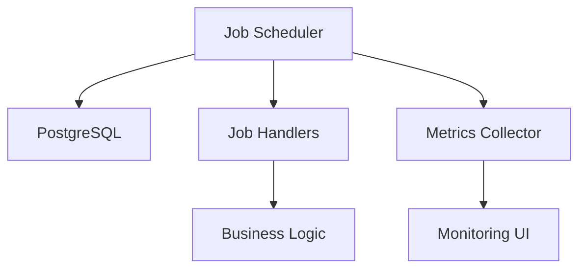

# Job Scheduler System

## Overview
The job scheduler system provides a robust and scalable solution for managing background tasks and scheduled jobs. Built on top of pg-boss, it offers reliable job processing with PostgreSQL as the backend.

Pluggable job schedulers are TBD.

## Key Features
- Immediate job execution
- Scheduled jobs with specific run times
- Recurring jobs with cron-like syntax
- Job monitoring and metrics
- Automatic retries with backoff
- Job history tracking

## Architecture


## Job Types
### Immediate Jobs
```typescript
await scheduler.scheduleImmediateJob('process-order', { orderId: 123 });
```

### Scheduled Jobs
```typescript
const runAt = new Date(Date.now() + 3600 * 1000); // 1 hour from now
await scheduler.scheduleScheduledJob('send-reminder', runAt, { userId: 456 });
```

### Recurring Jobs
```typescript
await scheduler.scheduleRecurringJob('daily-report', '0 0 * * *', {}); // Daily at midnight
```

## Monitoring and Metrics
The system provides real-time metrics through:
- Active jobs count
- Queued jobs count
- Completed jobs count
- Failed jobs count

Example metrics display:
```typescript
const metrics = await scheduler.getQueueMetrics();
// { active: 5, queued: 10, completed: 100, failed: 2 }
```

## Error Handling
The system implements:
- Automatic retries (3 attempts by default)
- Exponential backoff between retries
- Error logging and monitoring
- Manual job cancellation

## Example Job Handler
```typescript
scheduler.registerJobHandler('process-order', async (data) => {
  const order = await getOrder(data.orderId);
  await processOrder(order);
});
```

## Monitoring Interface
The job monitoring interface provides:
- Real-time job metrics
- Job history tracking
- Failed job inspection
- Job cancellation capabilities