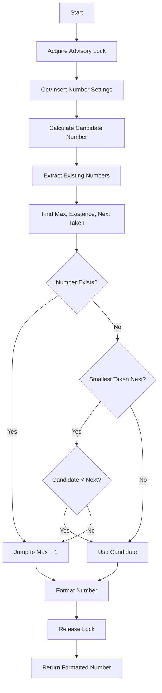

# Invoice Number Generation Flowchart

## Key Steps Explanation

1. **Advisory Lock**: Ensures thread safety for number generation
2. **Number Settings**: Gets or creates the numbering configuration
3. **Candidate Calculation**: Determines next number from sequence
4. **Number Analysis**: Extracts and analyzes existing numbers
5. **Conflict Check**: Determines if candidate is safe to use
6. **Gap Detection**: Finds available gaps in number sequence
7. **Formatting**: Applies prefix and padding as needed
8. **Cleanup**: Releases lock and returns result